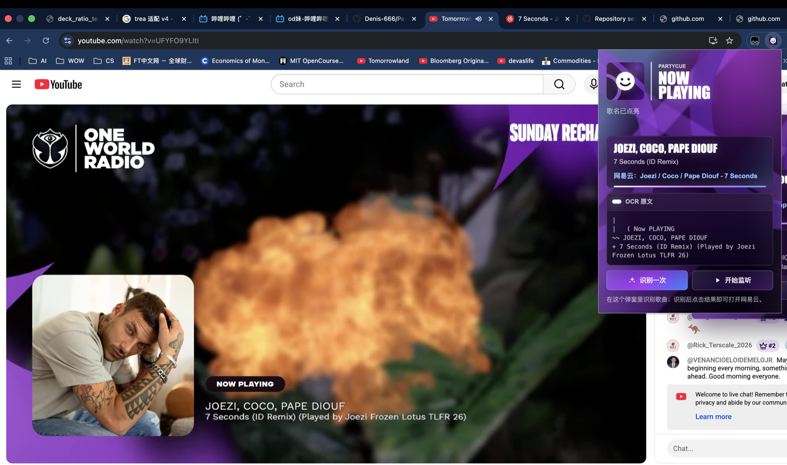
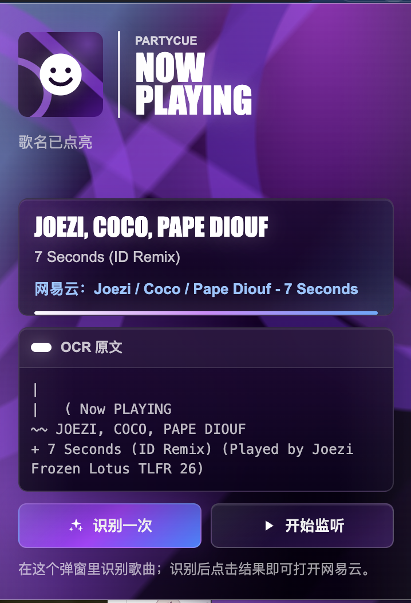
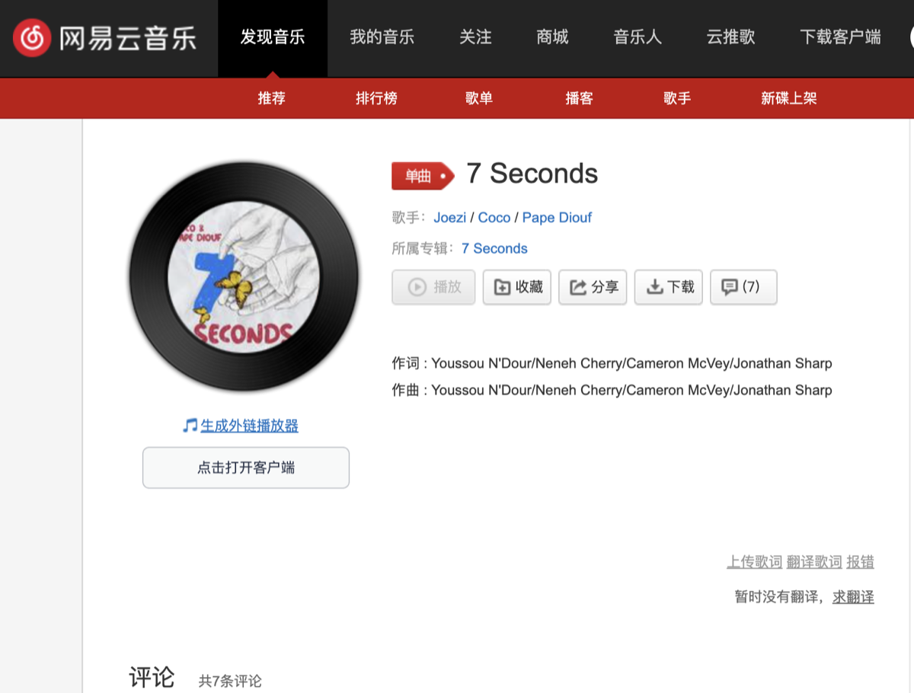

# PartyCue

听直播听到一首歌，脑子说“这什么神曲”，手却懒得搜。

PartyCue 就是来救场的 Chrome 小插件：打开 YouTube 电台直播，点一下识别当前歌名，再点一下跳到网易云。歌名不再逃跑，派对继续蹦。

示例直播：`https://www.youtube.com/watch?v=UFYFO9YLItI`

## 三步开趴

### 1. 打开直播，点右上角 PartyCue

先打开支持的 YouTube 直播页面，让画面里的 `Now Playing` 歌名区域露出来。然后点击 Chrome 右上角的 PartyCue 小笑脸，弹窗就会出现。



### 2. 点击「识别一次」，歌名点亮

在弹窗里点「识别一次」。PartyCue 会截图视频里的歌名区域，自己读字，然后把歌手、歌名和网易云结果显示出来。

想省手指？点「开始监听」，它会自动隔一会儿识别一次。



### 3. 点击网易云结果，直接跳转

识别成功后，点击蓝色的「网易云：歌曲名」那一行，就会打开网易云音乐页面。找到歌，收藏，继续摇。



## 安装

1. 下载或克隆这个项目。
2. 打开 Chrome 的 `chrome://extensions/`。
3. 打开右上角「开发者模式」。
4. 点击「加载已解压的扩展程序」。
5. 选择本项目文件夹。
6. 把 PartyCue 固定到浏览器工具栏，方便随时开灯。

## 小提示

- 第一次识别会加载本地 OCR 模型，可能要等几秒，别急，灯光师在热身。
- 如果识别不到，确认视频里的 `Now Playing` 没被遮住。
- 网易云不一定每首都有；找不到直达页时，会尽量打开搜索结果。
- PartyCue 不听麦克风，只看当前标签页截图里的歌名。

## 开发

安装依赖：

```bash
npm install
```

检查脚本语法：

```bash
npm run check
```

改完代码后，到 `chrome://extensions/` 里刷新 PartyCue，再回直播页面试一下。

## 项目结构

- `manifest.json`: Chrome Manifest V3 配置，加载 `src/` 里的运行时代码。
- `src/`: 扩展弹窗、内容脚本、后台 service worker 和离屏 OCR 页面。
- `icons/`: 扩展图标。
- `docs/`: README 截图和演示素材。
- `vendor/`: 打包到扩展内的 Tesseract.js、WASM 和英文模型。
- `tools/ocr-smoke/`: OCR 调参用的本地 smoke 页面和截图 fixture，不参与扩展运行。

## 许可证

MIT License. 免费、开放、欢迎 remix。愿你的播放列表永远有光。
