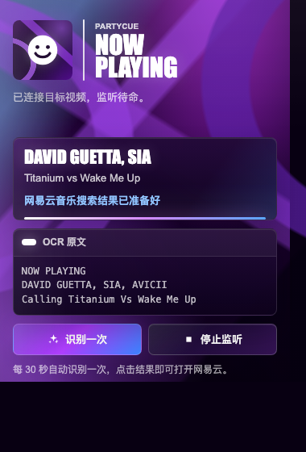
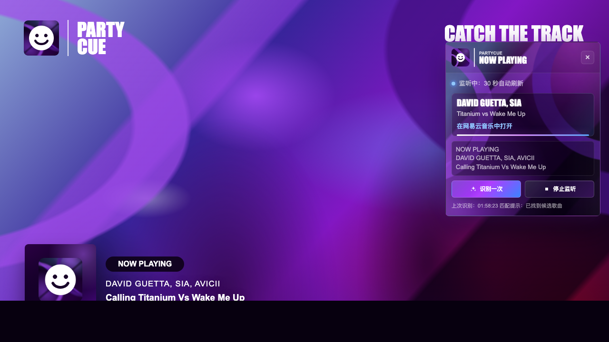

# PartyCue

把电台直播里的当前歌名抓出来，让派对继续往前跳。


PartyCue 是一个深紫舞台视觉、白色笑脸徽章风格的 Chrome 扩展。它会在指定 YouTube 电台直播画面里截取左下角 `Now Playing` 区域，用本地打包的 Tesseract.js 做 OCR，识别歌手和歌名，然后把你带去网易云音乐的歌曲页或搜索页。

当前支持的直播页面：

`https://www.youtube.com/watch?v=UFYFO9YLItI`

## UI 截图

扩展弹窗会显示连接状态、识别结果、OCR 原文和监听控制。



页面右上角浮层会常驻在直播页面里，方便边看直播边识别当前歌曲。



插件图标使用同一套深紫背景和白色笑脸标识。


## 小亮点

- 深紫电台风 UI，白色粗字和抽象舞台曲面更贴近直播视觉。
- 本地 OCR 识别视频画面里的歌名，不依赖页面 DOM。
- 一键识别当前歌曲，也可以每 30 秒自动监听一次。
- 匹配到网易云歌曲页就直达，匹配不到就打开搜索结果。
- MIT 免费开源，欢迎改造、玩耍、加灯光。

## 安装

1. 下载或克隆这个项目。
2. 打开 Chrome 的 `chrome://extensions/`。
3. 打开右上角“开发者模式”。
4. 点击“加载已解压的扩展程序”。
5. 选择本项目文件夹。
6. 确认扩展列表里出现 PartyCue，并把它固定到工具栏会更方便。

## 使用说明

1. 打开支持的 YouTube 直播页面。
2. 让视频左下角的 `Now Playing` 区域保持可见。
3. 点击 Chrome 工具栏里的 PartyCue 图标，扩展会连接当前标签页，并在页面右上角放置浮层。
4. 点击“识别一次”，PartyCue 会截图直播画面、裁剪左下角曲名区域，并用本地 OCR 读取文字。
5. 如果识别出歌手和歌名，弹窗和页面浮层都会更新结果，并给出网易云音乐直达或搜索链接。
6. 点击“开始监听”可以进入自动模式，扩展会每 30 秒识别一次。按钮变成“停止监听”后，再点一次即可停止。
7. 点击识别结果里的链接，去网易云继续听。

首次 OCR 会加载本地英文模型，可能需要几秒。扩展使用 `activeTab` 截图授权，如果提示无法截图，重新点击一次扩展图标通常就能重新开灯。

## 使用场景

- 想知道直播正在播哪首歌：打开弹窗后点“识别一次”。
- 想持续跟歌单：点“开始监听”，让浮层自动刷新曲名。
- 想去网易云收藏：识别成功后点击结果链接。
- 想隐藏页面浮层：点击浮层右上角的 `×`。

## OCR 小贴士

如果识别结果为空，可以试试这些动作：

- 把 YouTube 切到剧场模式或全屏。
- 确保左下角曲名区域没有被字幕、控制条或窗口边缘遮挡。
- 等直播画面稳定后再点“识别一次”。
- 如果刚加载扩展，先点一次工具栏图标，让 Chrome 授权当前标签页截图。

这个直播的曲名是画在视频里的，不是网页文本，所以画面尺寸和清晰度会影响识别率。

## 权限说明

PartyCue 使用的权限都围绕当前标签页截图、本地 OCR 和网易云搜索结果解析：

- `activeTab` / `tabs`: 获取当前标签页并截取直播画面。
- `scripting`: 在目标 YouTube 页面注入页面浮层。
- `storage`: 保存当前识别状态，让弹窗和页面浮层同步。
- `offscreen`: 在离屏页面里运行 Tesseract.js OCR。
- `https://www.youtube.com/*`: 读取目标直播画面。
- `https://music.163.com/*`: 查询网易云音乐搜索结果。

## 项目结构

- `manifest.json`: Chrome Manifest V3 配置。
- `popup.html` / `popup.css` / `popup.js`: 扩展弹窗。
- `content.js`: 页面浮层、截图裁剪、OCR 解析和监听逻辑。
- `background.js`: 当前标签页截图和网易云搜索结果解析。
- `offscreen.html` / `offscreen.js`: 离屏 OCR 工作区。
- `icons/`: PartyCue 深紫笑脸徽章图标。
- `docs/`: README 截图和展示素材。
- `vendor/`: 本地打包的 Tesseract.js、WASM 和英文模型。

## 开发

安装依赖：

```bash
npm install
```

检查脚本语法：

```bash
npm run check
```

改完代码后，在 `chrome://extensions/` 里点 PartyCue 的刷新按钮，再回到直播页面试一下。

## 许可证

MIT License. 免费、开放、欢迎 remix。愿你的播放列表永远有光。
